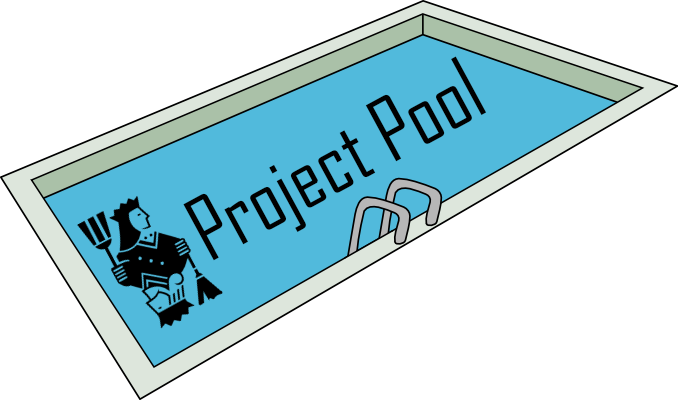
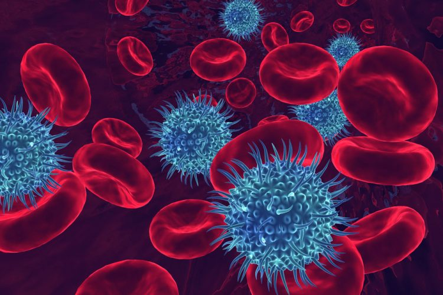
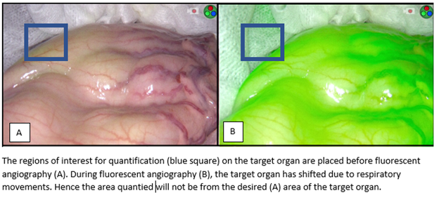
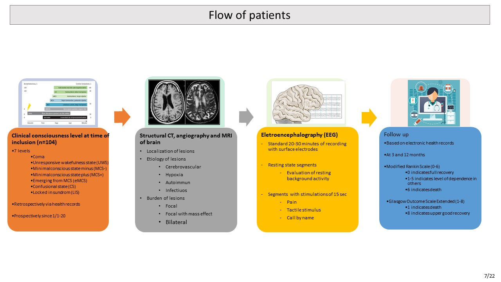
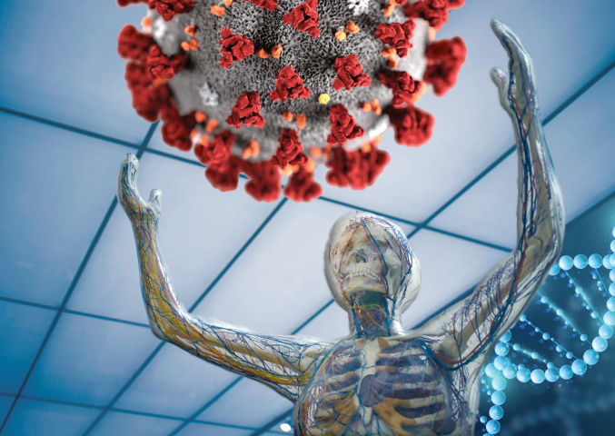
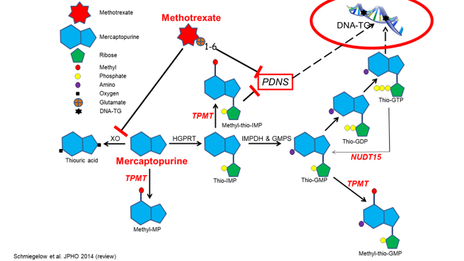
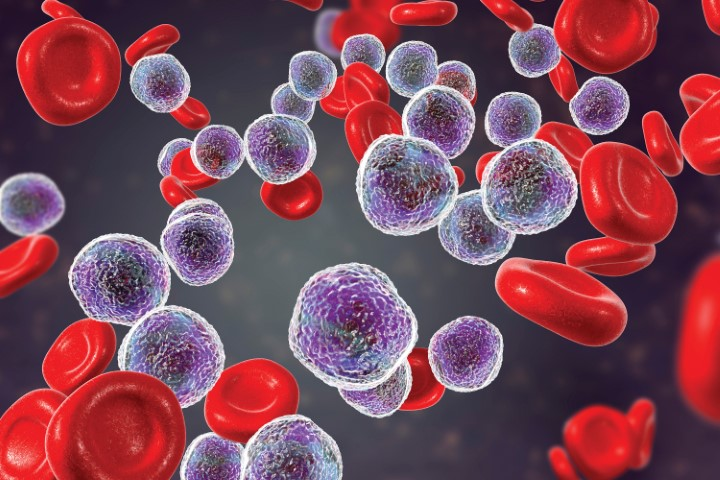
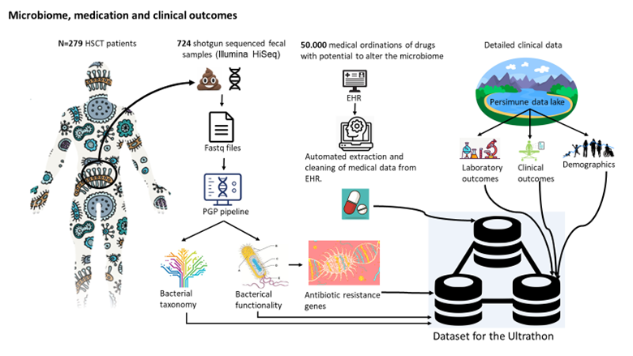

<a id="top"></a>

<p align="center"></p>

# Project pool for the 2021 Copenhagen Ultrathon in Medical AI and Precision Medicine

This page contains the manifest of all projects entering the 2021 Copenhagen Ultrathon. If you have project-specific questions, please make use of the discussion forums available on the repositories of each project. Links to the websites and repositories for each of the Medical AI Datasheets (MAIDS) are included in the details section for each dataset.

> Visit the manifest's [website](https://ultrathononline.github.io/U21-PROJECT-POOL/) or [repository](https://github.com/UltrathonOnline/U21-PROJECT-POOL).

If you have general questions on the _2021 Ultrathon_ then please use the [discussion forum](https://github.com/UltrathonOnline/U21-PROJECT-POOL/discussions) in the repository.

> There are several ways to stay informed:
> * Visit the Ultrathon's [landing page](https://ultrathon.online) and sign up to the mailing list.
> * Follow us on [Twitter](https://twitter.com/UltrathonOnline).
> * Watch the repository for changes.

## Manifest

The following table lists projects entered into the 2021 Ultrathon. Click on the links in the ID column to scroll down to the details section for the project's dataset. The MAIDS descriptions are available in PDF, Website, or Git repositories from the MAIDS column.

Applicants will be asked to submit presolutions (small idealized solutions) when applying to attend the event. A committee will select attendees based on the scientific merit of presolutions. An exact rubric will be published later this year. Participants will have the opportunity to take their ideas through to publication during the six week event.

<table width="95%">
    <tr><th width="12%">ID</th><th width="70%">Title</th><th width="18%">MAIDS</th></tr>
    <tr><td><a href="#-u21-01">U21-01</a></td><td>Prediction of bloodstream infections: Blood culturing data associated to clinical metadata</td><td><a href="">pdf</a>, <a href="">site</a>, <a href="">repo</a></td></tr>
    <tr><td><a href="#-u21-02">U21-02</a></td><td>Fluorescence angiography</td><td><a href="">pdf</a>, <a href="">site</a>, <a href="">repo</a></td></tr>
    <tr><td><a href="#-u21-03">U21-03</a></td><td>Consciousness in neurocritical care cohort study</td><td><a href="">pdf</a>, <a href="">site</a>, <a href="">repo</a></td></tr>
    <tr><td><a href="#-u21-04">U21-04</a></td><td>Predicting the immune response to SARS-CoV-2 in the COVIMUN cohort, a study of host genetics and cytokine response profiles in the context of known immunological pathways</td><td><a href="">pdf</a>, <a href="">site</a>, <a href="">repo</a></td></tr>
    <tr><td><a href="#-u21-05">U21-05</a></td><td>Thiopurine/methotrexate maintenance therapy of acute lymphoblastic leukemia</td><td><a href="">pdf</a>, <a href="">site</a>, <a href="">repo</a></td></tr>
    <tr><td><a href="#-u21-06">U21-06</a></td><td>Predict risk of infection (blood culture drawn) and chance of treatment free survival 4 years from start of first CLL treatment</td><td><a href="">pdf</a>, <a href="">site</a>, <a href="">repo</a></td></tr>
    <tr><td><a href="#-u21-07">U21-07</a></td><td>Microbiome, medication and clinical outcomes</td><td><a href="">pdf</a>, <a href="">site</a>, <a href="">repo</a></td></tr>
    <tr><td><a href="#-u21-08">U21-08</a></td><td>Prediction of peptide-epitope binding – the keyto immune response, vaccine design and drug design</td><td><a href="">pdf</a>, <a href="">site</a>, <a href="">repo</a></td></tr>
</table>
  
## Details

### **&#10149; U21-01**

#### **Prediction of bloodstream infections: Blood culturing data associated to clinical metadata**

<p align="center"></p>

>Visit this dataset's MAIDS [site](https://ultrathononline.github.io/MAIDS.U21-01.Blood_Infection/) and [repo](https://github.com/UltrathonOnline/MAIDS.U21-01.Blood_Infection).

```
Karen Leth Nielsen, Frederik Boëtius Hertz, Niels Frimodt-Møller, Steen Rasmussen, Ruth Frikke-Schmidt,
Jesper Qvist Thomassen
@: Rigshospitalet, Copenhagen, Denmark

The present dataset was created for machine learning in order to improve the prediction of bloodstream
infections. The dataset combines clinical blood parameters, age, sex as well as previous admissions to
blood culturing results (negative and positive) and resistance profile of the infecting pathogen over
a period of more than 10 years.
```
[top](#manifest) | [next](#-u21-02)

### **&#10149; U21-02**

#### **Fluorescence angiography**

<p align="center"></p>

>Visit this dataset's MAIDS [site](https://ultrathononline.github.io/MAIDS.U21-02.Florescence_angiography/) and [repo](https://github.com/UltrathonOnline/MAIDS.U21-02.Florescence_angiography).

```
Michael Achiam, Morten Bo Svendsen, Lars Bo Svendsen, Nikolaj Nerup, Jens Osterkamp
@: Rigshospitalet, Copenhagen, Denmark

The purpose was to offer quantities of videos to enable the development of motion correction algorithms
for subsequent data acquisition. The algorithm/program should be able to accurately adjust which pixels
are sampled within each frame to keep a Region-of-Interest within the target area and, thus, produce a
more sensitive and accurate quantification.
```
[prev](#-u21-01) | [top](#manifest) | [next](#-u21-03)

### **&#10149; U21-03**

#### **Consciousness in neurocritical care cohort study**

<p align="center"></p>

>Visit this dataset's MAIDS [site](https://ultrathononline.github.io/MAIDS.U21-03.Consciousness/) and [repo](https://github.com/UltrathonOnline/MAIDS.U21-03.Consciousness).

```
Daniel Kondziella, Moshgan Amiri
@: Rigshospitalet, Copenhagen, Denmark

Research on consciousness is mainly based on patients suffering from chronic brain injury, while data
regarding unresponsive patients with acute brain injury are sparse. As mentioned in the previous section,
most deaths in an ICU population occur because of withdrawal of life-sustaining therapy. Reducing the
risk for erroneous clinical prognostication is therefore crucial. There is a gap between the research on
chronic patients and research based on unresponsive patients suffering from acute brain injury in the ICU.
We established our database to be able to fill this gap. Our dataset was hence created to obtain a
representative prospective database with systematic registration of clinical, laboratory and imaging data
of unresponsive patients suffering from acute brain injury. The main purpose of the database is to
identify important information predicting level of consciousness and outcome (acute and long-term) in
these patients, which will help to optimize clinical decision-making.
```

[prev](#-u21-02) | [top](#manifest) | [next](#-u21-04)

### **&#10149; U21-04**

#### **Predicting the immune response to SARS-CoV-2 in the COVIMUN cohort, a study of host genetics and cytokine response profiles in the context of known immunological pathways**

<p align="center"></p>

>Visit this dataset's MAIDS [site](https://ultrathononline.github.io/MAIDS.U21-04.COVIMUN/) and [repo](https://github.com/UltrathonOnline/MAIDS.U21-04.COVIMUN).

```
Rebecka Svanberg, Carsten Niemann, Sisse Ostrowski, Rasmus Lykke Marvig, Preston Yui Sum Leung
>@: Rigshospitalet, Copenhagen, Denmark

The sudden emergence of a global pandemic with a new pathogen, SARS-CoV-2, created an instant need to
understand the immunologic reactions arising in response to infection with this pathogen,as well as
understanding the underlying patient-specific factors determining the circumstances within which these
immune reactions occur. As a result, the current dataset was created, combining whole genome sequencing
with consecutive extensive characterization of patient immune cell composition and phenotypes together
with in vitro functional assessment of stimulated whole blood immune responses. The current dataset
provides a unique opportunity to unravel correlations between genotype and immune phenotype- and function
in response to COVID-19, which could ultimately have significant clinical impact.
```

[prev](#-u21-03) | [top](#manifest) | [next](#-u21-05)

### **&#10149; U21-05**

#### **Thiopurine/methotrexate maintenance therapy of acute lymphoblastic leukemia**

<p align="center"></p>

>Visit this dataset's MAIDS [site](https://ultrathononline.github.io/MAIDS.U21-05.ALL/) and [repo](https://github.com/UltrathonOnline/MAIDS.U21-05.ALL).

```
Rikke Linnemann Nielsen, Kjeld Schmiegelow, Kathrine Grell
@: Rigshospitalet, Copenhagen, Denmark

To provide a deeper understanding of pharmacogenetics/-kinetics/-dynamics of MT and increase cure rates for
childhood leukemia. The datasets emerge from two Nordic childhood leukemia protocols (ALL92: 1992-2006) and
ALL2008 (2008-2018).
```

[prev](#-u21-04) | [top](#manifest) | [next](#-u21-06)

### **&#10149; U21-06**

#### **Predict risk of infection (blood culture drawn) and chance of treatment free survival 4 years from start of first CLL treatment**

<p align="center"></p>

>Visit this dataset's MAIDS [site](https://ultrathononline.github.io/MAIDS.U21-06.CLLTIM/) and [repo](https://github.com/UltrathonOnline/MAIDS.U21-06.CLLTIM).

```
Carsten U. Niemann, Rudi Agius
@: Rigshospitalet, Copenhagen, Denmark

Infections are the leading cause of mortality in CLL. Risk of Infection is increased upon CLL treatment and
currently we have no model that is able to predict risk of infection upon CLL treatment. The dataset created
puts together various sources of time-series electronic health records on CLL patients in Denmark. This also
includes outcome on death, treatment and infection. Using this data set we aim to both model risk of infection
upon CLL treatment and uncover risk factors responsible for low immune function and duration of treatment
response upon different treatment regimens.
```

[prev](#-u21-05) | [top](#manifest) | [next](#-u21-07)

### **&#10149; U21-07**

#### **Microbiome, medication and clinical outcomes**

<p align="center"></p>

>Visit this dataset's MAIDS [site](https://ultrathononline.github.io/MAIDS.U21-07.ARG/) and [repo](https://github.com/UltrathonOnline/MAIDS.U21-07.ARG).

```
Henrik Sengeløv, Jens Christian Nørgaard
@: Rigshospitalet, Copenhagen, Denmark

Based on one of the world's largest patient cohorts with metagenomic sequenced fecal samples we wanted to
describe the interplay between previous treatment with antibiotics and presence of antibiotic resistance genes
(ARGs). In order to do this, we have established a bioinformatic pipeline to map antibiotic resistance genes 
and we have established an automatic way of extracting data on use of antibiotics (anti-bacteria, -virus,
-fungi), immunosuppressants and chemotherapy. Moreover, we have detailed data on demographics, clinical
outcomes and other microbiome features such as taxonomy.
```

[prev](#-u21-06) | [top](#manifest) | [next](#-u21-08)

### **&#10149; U21-08**

#### **Prediction of peptide-epitope binding – the keyto immune response, vaccine design and drug design**

<p align="center"></p>

>Visit this dataset's MAIDS [site](https://ultrathononline.github.io/MAIDS.U21-08.MHC/) and [repo](https://github.com/UltrathonOnline/MAIDS.U21-08.MHC).

```
Marek Prachar, Sune Justesen, Daniel B. Steen-Jensen, Frederik O. Bagger
@: Rigshospitalet, Copenhagen, Denmark

Previous efforts of predicting peptide:MHC binding have been based on training data have been based
on affinity (ability to bind) and not stability (staying bound). We have found the latter to be much
more predictive for actually getting an immune reaction. Being able to predict immune response is
critical for vaccine design (you want immune response), drug design (you don’t want an immune response).
The dataset consists of two types of data one is precise and expensive, the other less precise
(binding/non-binding) and less expensive. Being able to make the full use the cheap data in a model
would mean an explosion of available data for this type of problems.
```

[prev](#-u21-07) | [top](#manifest)
